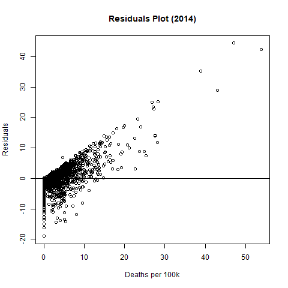
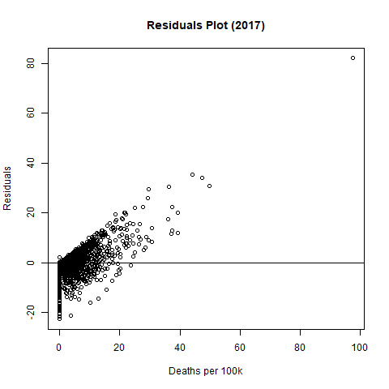

# gun-violence-uscounties

## Introduction

[Gun violence in the US](https://en.wikipedia.org/wiki/Gun_violence_in_the_United_States) has been a contentious subject of debate for decades. Political commentaries aside, there have been lots of research done by various academic groups and think tanks trying to explain this unfortunate phenomenon. `gun-violence-uscounties` project is my small contribution to this long history, primarily fueled by my intellectual curiosity on the topic.

More specifically, **this study aims to look at rates of gun violence in the US at the county level**. While country and state level analyses have been done many times, often they are not granular enough to capture more nuanced factors, as states and countries are large, heterogeneous entities. In addition, **this study aims to fit a statistical model predicting gun violence deaths** in a given year in given county. This is done to **comprehensively capture effects from multiple variables, ranging from demographic, economic, social, and political dimensions**. The models are designed to answer the question, **what factors most contributes to gun deaths in the US and how have they changed over time?**

## Methodology

### Factors Brainstorm

Initially, there were many different features I wanted to include in the model. The various proposed features spanned 6 different dimensions (Economic, Social, Demographic, Cultural, Political, and Geographic). Each dimension had several proposed metric under them as a starting point for the project.

1. Economic
	* Gini Coefficient - measure of economic inequality
	* Mean/median income
	* Unemployment rate
	* Poverty rate
2. Social
	* Crime
		* Murder and violent crime rate per capita
	* Presence of individuals with mental health issues per capita
		* Suicide/depression rate per capita
		* Depression rate per capita
3. Demographic
	* % of population based on age groups
	* % of population based on race
	* Male/female sex ratio
	* % of households married
4. Cultural
	*  Gun culture
		* Number of guns per capita
		* % of households with guns
	* Presence of gang or drug activity
5. Political
	* Political lean of a county
	* Measure of gun laws
6. Geographic
	* Latitude - to study effect of lack of sunlight on mental health
	* Local climate

However, as I began to look further into each proposed factors, I ran into several problems:

* Many metrics were not available at the county level
* Some metrics were highly correlated with each other

Due to these problems, I had to narrow down the available features to a more limited subset. The final features used and their data source are described in the next section.

### Feature Engineering and Data Sources

Below are the features and their data sources used for this analysis.

|Dimension   | Feature   | Data Source   |   
|---|---|---|
|Economic   | [Unemployment rate](https://en.wikipedia.org/wiki/Unemployment_in_the_United_States)  | [US Bureau of Labor Statistics](https://www.bls.gov/lau/#cntyaa) |   
|Economic   | [Poverty rate](https://en.wikipedia.org/wiki/Poverty_threshold#United_States)  | [US Department of Agriculture Economic Research Service](https://www.ers.usda.gov/data-products/county-level-data-sets/)   |   
|Demographic   | % of population by race  | [US Census Data](https://www2.census.gov/programs-surveys/popest/datasets/2010-2018/counties/asrh/)  |   
|Education   | % of population without high school degree  | [US Department of Agriculture Economic Research Service](https://data.ers.usda.gov/reports.aspx?ID=17829)  |   
|Political   | [Partisan Voter Index](https://en.wikipedia.org/wiki/Cook_Partisan_Voting_Index)   | [Cook Partisan Voting Index](https://www.cookpolitical.com/pvi-map-and-district-list)   |  

All features were converted into percentages, with the exception of the PVI. However, PVI itself is the % Democratic Party lean in a county, making it comparable to the other features. This simplified the model interpretation.

The actual gun violence data came from [Kaggle](https://www.kaggle.com/datasets/jameslko/gun-violence-data), and contain over 260k gun violence incidents from 2013 - 2018.

### Modeling

The modeling approach used was to try to predict the number of people killed in each county using a simple linear regression. The gun violence dataset was aggregated to calculate the number of people killed in each county. Also, to account for the population differences in each county, each data point (county) was weighted by its population.

In order to analyze how the importance of the above features changed over time (and to account for any seasonality in the data), the modeling was blocked by each year. There were 4 years where complete data was available, from 2014 to 2017.

The resulting model coefficients and their p-values were plotted over time, year to year.

For county $i$ in year $j$, number of people killed from gun violence per 100k is the following:

$$
\hat{y}_{i, j} = \alpha_j + \beta_j x_{i, j}
$$

Where

$$
\beta_j = (\beta_{NHWA}, \beta_{NHBA}, \beta_{NHNA}, \beta_{hisp}, \beta_{poverty}, \beta_{unemployment}, \beta_{NoHS}, \beta_{PVI})_j
$$

$$
x_{i, j} = (x_{i, NHWA}, x_{i, NHBA}, x_{i, NHNA}, x_{i, hisp} x_{i, poverty}, x_{i, unemployment}, x_{i, NoHS}, x_{i, PVI} )_j   
$$

For weighted linear regression, the cost function to minimize using ordinary least squares becomes the following:

$$
\sum_{i=1}^{n} w_{i, j}^2 \ ( y_{i, j} - ( \alpha_j + \beta_j x_{i, j} ) )^2
$$

Where

$$
w_{i,j} = county \ i \ population \ in \ year \ j
$$

### Limitations

This study, like all others, has limitations:

* Limits due to lack of data - Several dimensions listed above were not modeled in this study due to their lack of data. They include fairly important factors such as pravelence of guns, mental health issues, and geograpic.

* Limits of methodology - The GLM proposed here have modeling limitations, such as assumption of linear relationship between the independent and dependent variables. Also, interaction effects were not modeled in this study to keep the models as simple as possible for interpretation of results.

The approach taken in this study is largely done in the spirit of aphorism often quoted in statistics: *all models are wrong, but some are useful.*

## Results

### 1. Demographic Features

The demographic features were % of population in each county by race. The 4 features considered are the following:

| Plot Label  | Feature Description  |
|---|---|
| perc_NHWA  | Percent Non-Hispanic White American |
| perc_NHWA  | Percent Non-Hispanic Native American |
| perc_NHWA  | Percent Non-Hispanic Black American |
| perc_NHWA  | Percent Hispanic |

The regression coefficients, standard errors, and their p-values are shown below:

|    | index     |   year |   perc_NHWA |    perc_NHBA |   perc_NHNA |   perc_HISP |
|---:|:----------|-------:|------------:|-------------:|------------:|------------:|
|  0 | estimate  |   2014 | -0.00314285 |  0.153761    |   0.0249469 |  0.00973396 |
|  1 | std.error |   2014 |  0.0152667  |  0.0154062   |   0.143483  |  0.0159739  |
|  2 | statistic |   2014 | -0.205863   |  9.98046     |   0.173866  |  0.609367   |
|  3 | p.value   |   2014 |  0.836921   |  7.42597e-23 |   0.861991  |  0.54236    |
|  4 | estimate  |   2015 |  0.0245874  |  0.213713    |   0.273261  |  0.0298822  |
|  5 | std.error |   2015 |  0.0165805  |  0.0167498   |   0.161144  |  0.0174026  |
|  6 | statistic |   2015 |  1.48291    | 12.7591      |   1.69576   |  1.71712    |
|  7 | p.value   |   2015 |  0.138262   |  7.56612e-36 |   0.0900942 |  0.0861192  |
|  8 | estimate  |   2016 |  0.0170026  |  0.236146    |   0.373858  |  0.026114   |
|  9 | std.error |   2016 |  0.0186636  |  0.0188445   |   0.17854   |  0.0197299  |
| 10 | statistic |   2016 |  0.911006   | 12.5313      |   2.09397   |  1.32357    |
| 11 | p.value   |   2016 |  0.362404   |  1.02644e-34 |   0.0363906 |  0.185799   |
| 12 | estimate  |   2017 |  0.010636   |  0.228846    |   0.153797  |  0.00251736 |
| 13 | std.error |   2017 |  0.0194242  |  0.01957     |   0.190652  |  0.0205425  |
| 14 | statistic |   2017 |  0.547564   | 11.6937      |   0.806688  |  0.122544   |
| 15 | p.value   |   2017 |  0.584053   |  1.35386e-30 |   0.419943  |  0.902481   |

Regression coefficients show a clear statistical significance of one variable over time, **perc_NHBA**. One item to note here is that the perc_NHNA variable; the very large confidence interval of this coefficient is due to negligible Native-American population in most counties.

The coefficient magnitudes shows that all else being equal, per 1% increase in non-hispanic black population, there is increase of roughly 0.2 deaths per 100k population per county.

### 2. Economic Features  

| Plot Label  | Feature Description  |
|---|---|
| Econ_perc_poverty  | Percent Below the Poverty Threshold |
| Unemployment_rate  | Unemployment Rate |

The regression coefficients, standard errors, and their p-values are shown below:

|    | index     |   year |   Econ_perc_poverty |   Unemployment_rate |
|---:|:----------|-------:|--------------------:|--------------------:|
|  0 | estimate  |   2014 |         0.267873    |           0.031218  |
|  1 | std.error |   2014 |         0.0258433   |           0.056949  |
|  2 | statistic |   2014 |        10.3652      |           0.548174  |
|  3 | p.value   |   2014 |         1.7784e-24  |           0.583642  |
|  4 | estimate  |   2015 |         0.288876    |           0.0254343 |
|  5 | std.error |   2015 |         0.0295123   |           0.0741257 |
|  6 | statistic |   2015 |         9.78835     |           0.343124  |
|  7 | p.value   |   2015 |         4.11388e-22 |           0.731542  |
|  8 | estimate  |   2016 |         0.315022    |           0.0897241 |
|  9 | std.error |   2016 |         0.0329617   |           0.0870357 |
| 10 | statistic |   2016 |         9.55721     |           1.03089   |
| 11 | p.value   |   2016 |         3.46114e-21 |           0.30272   |
| 12 | estimate  |   2017 |         0.331917    |           0.10707   |
| 13 | std.error |   2017 |         0.0354018   |           0.104869  |
| 14 | statistic |   2017 |         9.37571     |           1.02098   |
| 15 | p.value   |   2017 |         1.80956e-20 |           0.307386  |

Of the two economic features considered, only the **Econ_perc_poverty** variable had statistically significant positive coefficient value.

The coefficient magnitudes shows that all else being equal, per 1% increase in poverty, there is increase of roughly 0.3 deaths per 100k population per county.

### 3. Education Features  

| Plot Label  | Feature Description  |
|---|---|
| Edu_perc_NoHS  | Percent with No High School Education |

The regression coefficients, standard errors, and their p-values are shown below:

|    | index     |   year |   Edu_perc_NoHS |
|---:|:----------|-------:|----------------:|
|  0 | estimate  |   2014 |     -0.0867682  |
|  1 | std.error |   2014 |      0.0312553  |
|  2 | statistic |   2014 |     -2.77611    |
|  3 | p.value   |   2014 |      0.00555958 |
|  4 | estimate  |   2015 |     -0.0907991  |
|  5 | std.error |   2015 |      0.0347562  |
|  6 | statistic |   2015 |     -2.61245    |
|  7 | p.value   |   2015 |      0.00905953 |
|  8 | estimate  |   2016 |     -0.0955807  |
|  9 | std.error |   2016 |      0.037493   |
| 10 | statistic |   2016 |     -2.5493     |
| 11 | p.value   |   2016 |      0.0108694  |
| 12 | estimate  |   2017 |     -0.0835212  |
| 13 | std.error |   2017 |      0.0401907  |
| 14 | statistic |   2017 |     -2.07812    |
| 15 | p.value   |   2017 |      0.0378265  |

Perhaps surprisingly, **Edu_perc_NoHS** variable had statistically significant **negative** coefficient each year.

### 4. Political Features  

| Plot Label  | Feature Description  |
|---|---|
| PVI_2016  | Partisan Voting Index (% Democratic Party Lean) |

The regression coefficients, standard errors, and their p-values are shown below:

|    | index     |   year |   PVI_2016 |
|---:|:----------|-------:|-----------:|
|  0 | estimate  |   2014 | 0.00350388 |
|  1 | std.error |   2014 | 0.00367793 |
|  2 | statistic |   2014 | 0.952676   |
|  3 | p.value   |   2014 | 0.340885   |
|  4 | estimate  |   2015 | 0.00607304 |
|  5 | std.error |   2015 | 0.00411872 |
|  6 | statistic |   2015 | 1.4745     |
|  7 | p.value   |   2015 | 0.140512   |
|  8 | estimate  |   2016 | 0.00547333 |
|  9 | std.error |   2016 | 0.00448042 |
| 10 | statistic |   2016 | 1.22161    |
| 11 | p.value   |   2016 | 0.222001   |
| 12 | estimate  |   2017 | 0.00803387 |
| 13 | std.error |   2017 | 0.00482191 |
| 14 | statistic |   2017 | 1.66612    |
| 15 | p.value   |   2017 | 0.0958478  |

The models found no positive correlations between political inclination of a county and the number of deaths due to gun violence.

### Residuals

Residuals from each year are shown below.

It is fairly clear from first glance that the residuals are not normally distributed. The residuals take large positive values as predictions become large, showing that the models are under predicting for counties with
high gun deaths per 100k.

The non-normality of the residuals suggests non-linearity or other independent variables at play, as described in the methodology limitations section.

## Conclusions

The following conclusions can be drawn from the above results.

**1. Gun violence in the US is largely a problem that affects African American community. This at least in part related to poverty, which is correlated with African American community presence.**

The two most statistically significant variables with positive coefficient values from the generalized linear models were percentage of population non-hispanic black and percentage of population living below poverty. The two variable are also correlated, as poverty is much more pravelent among African American community.

The underlying reasons for this are beyond the scope of this study, but one can reason based on several commonly known issues that specifically affect the African American community, including but not limited to:

* Presence of gang violence
* High prevalence of single motherhood
* Economic inequality
* Etc.

**2. There is no evidence that political leanings play any role on gun violence.**

Many political actors make claims of partisan bias contributing to gun violence. However, this analysis found no relationship between a county's partisan lean (Democratic lean in this case) and the number of deaths from gun violence. While the regression coefficients were positive year to year, none were statistically significant.

**3. There is also little evidence that unemployment rate or lack of education has an impact on gun violence.**

While poverty had a clear impact on gun violence, other economic and education factors did not  Curiously, there seems to be negative correlation between lack of eduction (high school degree) and deaths from gun violence in a county. The reason for this is unexplored in this study, although one can speculate it could be due to correlations with other variables.

**5. These findings, at least in period between 2014 - 2017, have remained largely consistant.**

All variables that were found to be statistically significant remained so in the 4 years modeled in this study. This suggests that factors contributing to gun violence in the US are consistent, with any underlying changes happening slowly, on time period much longer than this analysis.

**6. There are other effects this model is failing to capture.**

The non-normality of the residuals points towards non-linearity or other independent variables at play.

### Final Thoughts

Finally, I would like to say a few words about this subject and myself. I understand that gun violence in the US is a contentious subject, with strong opinions on all sides of the political spectrum.

I also acknowledge that it is near impossible to completely separate one's biases when studying an issue like this. I can, however, at least be transparent about my own biases and let the readers make up their own mind based on the quality of the data and analysis presented. I am someone who believes fairly strongly in 2nd amendment rights, and that these rights necessarily come at a social cost. At the same time, I believe much can be done to reduce gun violence in the US.

### Acknowledgements

I would like to thank the following people for giving their thoughts and feedback on this project:

## References
